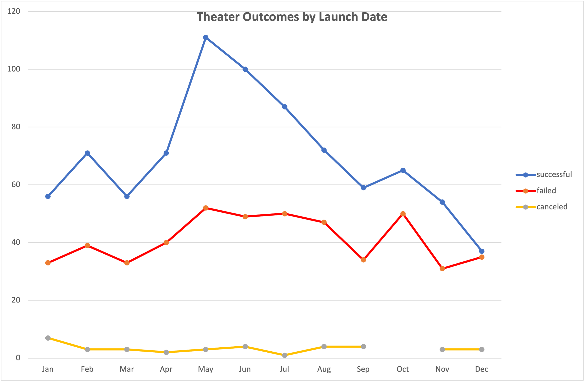
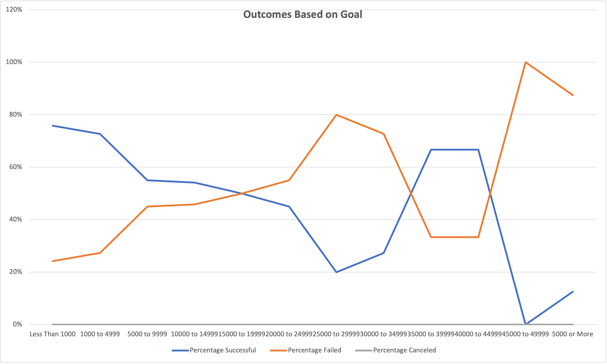

# Kickstarter_Challenge
Weekly Challenge for the Module 1

# Kickstarting with Excel

## Overview of Project

Louise, a play wrighter, wanted to start a crowdfunding to get help for starting her play called "Fever". initially we have performed data analysis to help find whether there are any specific factor that will help achieving a successful crowdfunding campaing by using data over 4000 crowdfunding projects. 

Her play Fever could reach close to its goal in a short amount of time. Now she is interested in knowing how different campaigns fared in relation to their launch dates and their funding goals. Her aim is to look for musicals in Great Britain.

### Purpose

The purpose of this project was to analyze and visualize crowdfunding campaign outcomes based on their launch dates and their funding goals to understand the effect of the campain launch date on the success, failure, or cancellation outcome.

## Analysis and Challenges
During this project, the data were analyzed using Microsoft Excel as follows.
- Initially, the data were analyzed by using pivot tables, pivot charts
- Extracted Year into a new column "Year" from the date in the "Date Created Conversion" column. 
- A pivot table was created using "Date Created Conversion" in the rows and outcomes in column. The "Years" and "Parent Category" were used as filters. Only the campaign outcomes in "Successful", "Failed", and "Cancelled" were used in the pivot table. 
- The parent category in the pivot table was filtered to show only "theatre" as the parent category. The campaign outcomes were sorted indescending order. 
- A pivot line chart was created using the pivot table to visualize the trends in the outcomes (based on launch date and based on goals).

Link to the spreadsheet (Kickstarter_Challenge.xlsx) is available in the repository: [Kickstarter_Challenge](Kickstarter_Challenge.xlxs)

### Analysis of Outcomes Based on Launch Date

### Analysis of Outcomes Based on Goals

### Challenges and Difficulties Encountered

## Results

- What are two conclusions you can draw about the Outcomes based on Launch Date?

Based on the chart (Figure 1), 

1) Successful campaigns were increased over the launch dates in the first five months although there was a slight fluctuation between January and March) and then started to decline (again slight increase in October).

2) The peak highest successful campaigns were achieved for the campaigns those were launced in May.

### Figure 1. Theater Outcomes by Launch Date
- What can you conclude about the Outcomes based on Goals?
General tendancy is that the percentage of successful campaigns were gradually decreased with increase of the goal set for the crowdfunding. 

It is interesting that there was a range of goal amount where the percent success rate was increased again, and then decreased.  

### Figure 2.Theater Outcomes by Goals

- What are some limitations of this dataset?

In this analysis, we have analyzed cumulative data for all years. However, the results for individual years may have differences and these data should also be reviewed for individual years before making decisions. Therefore, it is better to perform descriptive statistics to get a better overview of the campaigns over the years from 2009 - 2017. We may need more data points as well.  

- What are some other possible tables and/or graphs that we could create?
Descriptive statistics tables, distribution plots, and box plots. 
